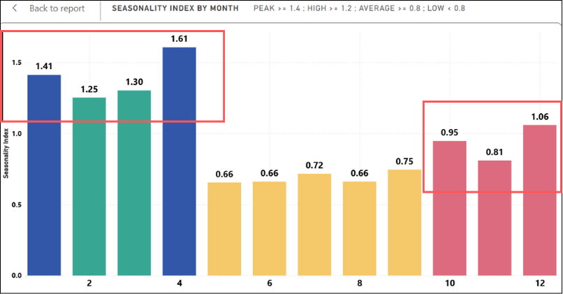
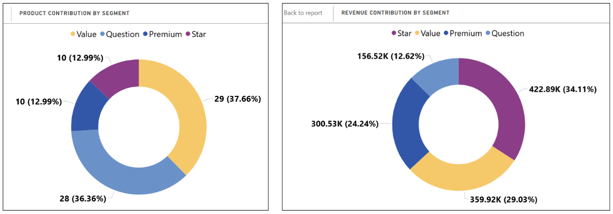
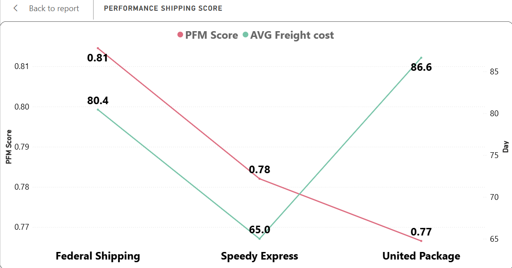

# 📊 Northwind Traders' Business Performance Analysis

## 📌 1. Context & Objectives
Analyse Northwind Traders' business performance to identify key revenue 
drivers across products, promotions, cross-selling and shipping efficiency 
— supporting data-backed decisions on inventory and logistics strategy.

## 🔧 2. Tools & Technical Deep Dive
### 2.1 Tools
- SQL
- Power BI (DAX, Power Query)

### 2.2 Data preprocessing
- Missing values are logically consistent — no action required.
- No incorrect data types detected.

## 📊 3. Results & Key Findings
- Business shows clear seasonality: Q1 is peak season, Q3 is low season.
- 74% of products are low-price but contribute only 42% of revenue.
- 2/3 of shipping companies deliver reasonable cost-efficiency.
- See more information about categories, employees, customers, markets and recommendations etc. in the report.

## 📁 4. Others
- Source Dataset: [Northwind Traders – Maven Analytics](https://mavenanalytics.io/data-playground/northwind-traders)
- Report (Vietnamese ver): [Report](https://canva.link/al3ij4iy1f8wqo4)
- Dashboard: loading ...
