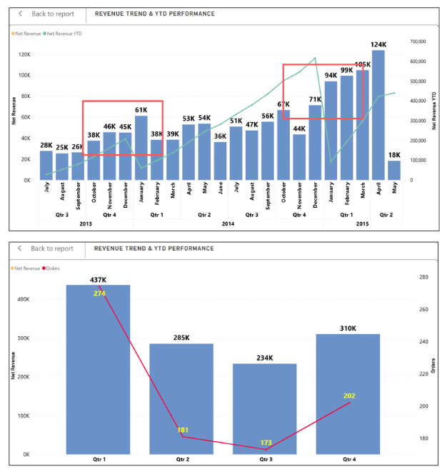

# 📊 Northwind Traders' Business Performance Analysis

## 📌 Objective
Analyse Northwind Traders' business performance to identify key revenue 
drivers across products, promotions, cross-selling and shipping efficiency 
— supporting data-backed decisions on inventory and logistics strategy.

## 🔧 Tools & Technologies
- SQL
- Power BI (DAX, Power Query)

## 📊 Key Findings
- 74% of products are low-price but contribute only 42% of revenue
- 78% of cross-selling orders drive 90% of revenue in top categories
- 2/3 of shipping companies deliver reasonable cost-efficiency

## 💡 Recommendations
- Develop stock preparation plan for top categories during peak seasons
- Shift product segment strategy to exploit underperforming price tiers
- Optimise shipping partner allocation based on cost-efficiency analysis

## 📁 Dataset
Source: [Northwind Traders – Maven Analytics](https://mavenanalytics.io/data-playground/northwind-traders)

## 📷 Dashboard Preview

